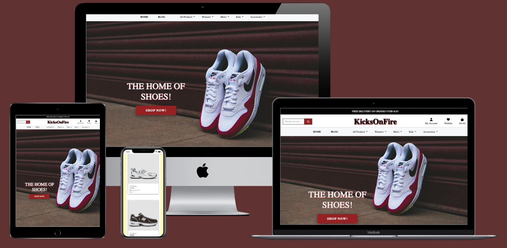

<h1 align="center"><a href="https://kicks-on-fire-5b791a86ef14.herokuapp.com/">KicksOnFire </a></h1>


<div align="center">

[](https://github.com/ciarangriffin93/KicksOnFire/commits/main)
[](https://github.com/ciarangriffin93/KicksOnFire/commits/main)
[](https://github.com/ciarangriffin93/KicksOnFire)

</div>

## Introduction

Welcome to KicksOnFire, your online destination for comfortable sneakers! Our modern e-commerce platform offers a curated selection of top-quality sneakers, carefully chosen to meet all your style and performance needs.

In addition to our diverse range of sneakers, we provide convenient features like account creation. By creating an account, you can easily add products to your wishlist and write reviews for your favorite items.

This business idea is close to my heart, as it lets me combine my love of fashion sneakers with my passion for using Django, HTML, CSS, JavaScript, and Python.



View live site: [KicksOnFire](https://kicks-on-fire-5b791a86ef14.herokuapp.com/)

## UX


### Colour Scheme

I used [coolors.co](https://coolors.co/9e2022-fefcfc-fff7c0-000000-212529) to generate my colour palette.

<details>


</details>

This CSS file is used to define colors as needed:

- --Auburn: #9E2022;
- --White: #FEFCFC;
- --Lemon chiffon: #FFF7C0;
- --Black: #000000;
- --Eerie black #212529;

### Typography


## User Stories

* Epic: Account Management

| User Story | Priority |
|------------|------------------|
| As a **user**, I can **create** an account so that I can **access personalized features and save preferences.** | **MUST HAVE** |
| As a **user**, I can **log into my account so that** I can **access my personal settings and history order and detail checkout** | **MUST HAVE** |
| As a user, I can log out of my account so that I can ensure my account is secure when I'm not using it. | **MUST HAVE** |
| As a user, I can update my account/profile so that I can keep my personal information up to date for checking out. | **MUST HAVE** |
| As a user, I can delete my account so that I can remove my personal data. | **MUST HAVE** |
| As a user, I can access and view my user profile so that I can see my personal information, order history, and manage my account settings. | **MUST HAVE** |

* Epic: User Dashboard (Registered Customers)

| User Story | Priority |
|------------|------------------|
| As a user, I want to add products to a wishlist so that I can save them for future. | **MUST HAVE** |

* Epic: Product Management (Staff)

| User Story | Priority |
|------------|------------------|
| As a staff member, I can create new products so that I can offer more choices to customers. | **MUST HAVE** |
| As a staff member, I can update product details so that I can ensure all information about the products is current. | **MUST HAVE** |
| As a staff member, I can delete products so that I can remove items that are no longer available. | **MUST HAVE** |

* Epic: Cart and Checkout

| User Story | Priority |
|------------|------------------|
| As a customer, I can add products to my cart so that I can purchase them. | **MUST HAVE** |
| As a customer, I can remove products from my cart so that I can manage items before finalizing my purchase. | **MUST HAVE** |
| As a customer, I can see an order summary in the cart so that I can review my order before completing the purchase. | **MUST HAVE** |
| As a customer, I can complete the checkout pay so that I can finalize my order. | **MUST HAVE** |

* Epic: Review System

| User Story | Priority |
|------------|------------------|
| As a registered customer, I can create reviews for products so that I can share my experience with others. | **MUST HAVE** |
| As a registered customer, I can update my reviews so that I can modify my feedback if my opinion changes. | **MUST HAVE** |
| As a registered customer, I can delete my reviews so that I can remove my feedback if I no longer wish it to be displayed. | **MUST HAVE** |

* Epic: Blog Management (Staff)

| User Story | Priority |
|------------|------------------|
| As a staff member, I can create blog posts so that I can provide valuable content to customers and visitors. | **MUST HAVE** |
| As a staff member, I can update blog posts so that I can keep the content current and relevant. | **MUST HAVE** |
| As a staff member, I can delete blog posts so that I can remove outdated or irrelevant content. | **MUST HAVE** |

* Epic: Comment System (Registered Customers)

| User Story | Priority |
|------------|------------------|
| As a registered customer, I can create comments on blog posts so that I can engage in discussions and share my thoughts. | **MUST HAVE** |
| As a registered customer, I can update my comments so that I can change my input or correct mistakes. | **MUST HAVE** |
| As a registered customer, I can delete my comments so that I can remove my input if I change my mind. | **MUST HAVE** |

## Wireframes

* [Balsamiq](https://balsamiq.com/wireframe) was used to create basic wireframes for KicksOnFire.

### Mobile Wireframes
<details>


</details>

### Desktop Wireframes
<details>


</details>


## Features

### Existing Features

### Hero Section

he Hero Section spans the entire width of the screen and is positioned at the top of the page, above the fold (the part of the webpage that is visible without scrolling). Because of its prominent placement, I aimed to make it visually striking to capture the visitor’s attention and encourage them to explore more of the website’s content or offerings.


### Navigation Bar

The navigation bar and the free delivery option for desktop orders are clearly visible over the hero image.

In the center of the navigation bar, there are menu links to the store's departments: Men's, Women's, and Accessories. Clicking any of these links will take users to the corresponding product listing page for shoes in that department.

On the right side of the navigation bar, users will see options to log in or register for an account on the website. This section also includes a cart icon that displays the user's current cart total. Additionally, once the user is logged in, they can access a profile section to manage their account details, along with a wishlist section that allows them to save products they may wish to purchase in the future.


### Products Page

The products page displays all available items. Users can sort by price, category.


### Products Detail Page

Clicking on the image or name of a product will direct the user or shopper to the Product Details Page for that specific item. This page will feature a larger image of the product along with more detailed information about it.


### Proucts Detail Wishlist Page 

The wishlist is an additional feature added to the store that was not included in the basic plan. This feature is only available to registered and logged-in users. From the Product Detail page, a user can click the "Add to Wishlist" button, adding that product to their wishlist.


### Wishlist Page

Users can view a list of the products in their wishlist by clicking the "Add to Wishlist" button. This action will direct them to their wishlist page. 

The wishlist page consists of a loop that renders each item in the wishlist. There is also a "Remove from Wishlist" button that users can click to remove an item from their wishlist. 

Clicking the product name on the card will take the user to the Product Details page for that specific product.


### Products Detail Reviews

Customers who are logged in can leave a review on a product. The review section can be found on the Product Details page, located below the product information.

The review form is straightforward and consists of a text area where users can write their reviews, along with a select box that allows users to rate the product on a scale from 1 to 5.


### Edit/Delete Reviews

A logged-in user can edit or delete their own comment. Editing a comment will submit the new version.


### Your bag Shopping Page

The shopping bag page shows all products in the cart and their details. Users can update the quantity of products or remove items from the shopping bag.


### Update/Remove Success Your Bag Shopping

Users can update the product quantity or remove products from the shopping bag, which will display a success toast.


### Free Delivery Your Bag Shopping

The total cost, including delivery fees, is displayed. A message will notify the user if the minimum amount for free delivery has not been reached, indicating how much more is needed.


### Checkout Page

The checkout page displays a form for users to complete their purchase by providing necessary contact, shipping, and payment information.


### Checkout success

After successfully checking out and processing payment through Stripe, the Checkout Success Page will be displayed. This page presents the order details and user information, allowing the customer to confirm that the provided information is accurate.


### My Profile Page

User clicks on my profile in the top navigation to view their order history details, which they can keep for their records.


### Product Management Admin Only

Administrators can click on Product Management in the top navigation to access additional functionality, allowing them to add a new product to the store or database from the front end. This feature can be accessed by selecting Profile Management.

This makes it easy for store owners to add new products by filling out the required product information and clicking "Add Product."


Admin Django Backend Panel - Admin Only


### Footer

KicksOnFire’s footer includes the company’s social media connections. The Facebook page for KicksOnFire opens in a new tab, while my LinkedIn and GitHub profiles are also linked and will open in new tabs. The “Contact Us” button opens a modal for any inquiries. Additionally about, there is a section about the KicksOnFire story. 

Users can sign up for weekly emails through the newsletter subscription form with all the information they need about KicksOnFire.

Underneath, you'll find the store’s Privacy Policy and Terms and Conditions. The Privacy Policy opens in a new tab, while the Terms and Conditions are displayed on a new KicksOnFire webpage, thanks to Termly's pasteable HTML block, after you provide the relevant business details.


### Contact Us

Customers can contact us with any queries they may have. Once they submit their name, email, and message, they will be directed to a thank you page that includes a ‘Return Home’ button. The Admin can view the messages in their connected business email service and respond directly to the customers.


### Register Form (Sign Up)

Enable shoppers to create an account on the website.


### Sign In Form


### Sign Out Form 

The sign-out page is designed for security. Would you like to log out of your account securely?


### 404 Page 

"404 Not Found” is displayed when a user tries to access a page that doesn’t exist. This message suggests that the user may have mistyped the URL or clicked on a broken link. The page includes a button to redirect users back to the homepage.


### 500 Page

HTTP error code 500 indicates an internal server error, which means there is a problem with the website's server.


### Future Features

Kicksofire’s e-commerce store is performing well, but the team is committed to enhancing the shopping experience even further. An exciting update will involve revamping the hero images on the homepage to feature a diverse range of products for men, women, and kids. Each hero image will spotlight popular items—such as sleek men's sneakers, trendy women's footwear, and stylish kids' shoes—while also introducing improved sizing options like 6, 7, 8, and 9 for kids' products. These changes aim to create a visually engaging and user-friendly shopping journey for every customer.


## Tools & Technologies Used

- [](https://tim.2bn.dev/markdown-builder) used to generate README and TESTING templates.
- [](https://git-scm.com) used for version control. (`git add`, `git commit`, `git push`)
- [](https://github.com) used for secure online code storage.
- [](https://gitpod.io) used as a cloud-based IDE for development.
- [](https://en.wikipedia.org/wiki/HTML) used for the main site content.
- [](https://en.wikipedia.org/wiki/CSS) used for the main site design and layout.
- [](https://www.javascript.com) used for user interaction on the site.
- [](https://jquery.com) used for user interaction on the site.
- [](https://www.python.org) used as the back-end programming language.
- [](https://pages.github.com) used for hosting the deployed front-end site.
- [](https://www.heroku.com) used for hosting the deployed back-end site.
- [](https://getbootstrap.com) used as the front-end CSS framework for modern responsiveness and pre-built components.
- [](https://flask.palletsprojects.com) used as the Python framework for the site.
- [](https://www.djangoproject.com) used as the Python framework for the site.
- [](https://dbs.ci-dbs.net) used as the Postgres database from Code Institute.
- [](https://www.elephantsql.com) used as the Postgres database.
- [](https://cloudinary.com) used for online static file storage.
- [](https://whitenoise.readthedocs.io) used for serving static files with Heroku.
- [](https://stripe.com) used for online secure payments of ecommerce products/services.
- [](https://mail.google.com) used for sending emails in my application.
- [](https://mailchimp.com) used for sending newsletter subscriptions.
- [](https://aws.amazon.com/s3) used for online static file storage.
- [](https://balsamiq.com/wireframes) used for creating wireframes.
- [](https://www.canva.com/p/canvawireframes) used for creating wireframes.
- [](https://fontawesome.com) used for the icons.
- [](https://chat.openai.com) used to help debug, troubleshoot, and explain things.

## Database Design


A couple recommendations for building free ERDs:
- [Lucidchart](https://www.lucidchart.com/pages/ER-diagram-symbols-and-meaning)

I have used `pygraphviz` and `django-extensions` to auto-generate an ERD.

The steps taken were as follows:
- In the terminal: `sudo apt update`
- then: `sudo apt-get install python3-dev graphviz libgraphviz-dev pkg-config`
- then type `Y` to proceed
- then: `pip3 install django-extensions pygraphviz`
- in my `settings.py` file, I added the following to my `INSTALLED_APPS`:
```python
INSTALLED_APPS = [
    ...
    'django_extensions',
    ...
]
```
- back in the terminal: `python3 manage.py graph_models -a -o erd.png`
- dragged the new `erd.png` file into my `documentation/` folder
- removed `'django_extensions',` from my `INSTALLED_APPS`
- finally, in the terminal: `pip3 uninstall django-extensions pygraphviz -y`

Entity Relationship Diagrams (ERDs) assist in visualizing the structure of a database.


## Agile Development Process

### GitHub Projects

[GitHub Projects](https://github.com/ciarangriffin93/KicksOnFire/projects) served as an Agile tool for this project.
It isn't a specialized tool, but with the right tags and project creation/issue assignments, it can be made to work.


### GitHub Issues

[GitHub Issues](https://github.com/ciarangriffin93/KicksOnFire/issues) served as an another Agile tool.
There, I used my own **User Story Template** to manage user stories.


- [Open Issues](https://github.com/ciarangriffin93/KicksOnFire/issues) [](https://github.com/ciarangriffin93/KicksOnFire/issues)

    

- [Closed Issues](https://github.com/ciarangriffin93/KicksOnFire/issues?q=is%3Aissue+is%3Aclosed) [](https://github.com/ciarangriffin93/KicksOnFire/issues?q=is%3Aissue+is%3Aclosed)

    

### MoSCoW Prioritization

I've decomposed my Epics into stories prior to prioritizing and implementing them.
Using this approach, I was able to apply the MoSCow prioritization and labels to my user stories within the Issues tab.

- **Must Have**: guaranteed to be delivered (*max 60% of stories*)
- **Should Have**: adds significant value, but not vital (*the rest ~20% of stories*)
- **Could Have**: has small impact if left out (*20% of stories*)
- **Won't Have**: not a priority for this iteration

## Ecommerce Business Model

This site sells goods to individual customers, and therefore follows a `Business to Customer` model.
It is of the simplest **B2C** forms, as it focuses on individual transactions, and doesn't need anything
such as monthly/annual subscriptions.

It is still in its early development stages, although it already has a newsletter, and links for social media marketing.

Social media can potentially build a community of users around the business, and boost site visitor numbers,
especially when using larger platforms such a Facebook.

A newsletter list can be used by the business to send regular messages to site users.
For example, what items are on special offer, new items in stock,
updates to business hours, notifications of events, and much more!

## Search Engine Optimization (SEO) & Social Media Marketing

### Keywords

I've identified some appropriate keywords to align with my site, that should help users
when searching online to find my page easily from a search engine.
This included a series of the following keyword types

- Short-tail (head terms) keywords
- Long-tail keywords

I also played around with [Word Tracker](https://www.wordtracker.com) a bit
to check the frequency of some of my site's primary keywords (only until the free trial expired).

### Sitemap

I've used [XML-Sitemaps](https://www.xml-sitemaps.com) to generate a sitemap.xml file.
This was generated using my deployed site URL: https://kicks-on-fire-5b791a86ef14.herokuapp.com

After it finished crawling the entire site, it created a
[sitemap.xml](sitemap.xml) which I've downloaded and included in the repository.

### Robots

I've created the [robots.txt](robots.txt) file at the root-level.
Inside, I've included the default settings:

```
User-agent: *
Disallow:
Sitemap: https://kicks-on-fire-5b791a86ef14.herokuapp.com/sitemap.xml
```

Further links for future implementation:
- [Google search console](https://search.google.com/search-console)
- [Creating and submitting a sitemap](https://developers.google.com/search/docs/advanced/sitemaps/build-sitemap)
- [Managing your sitemaps and using sitemaps reports](https://support.google.com/webmasters/answer/7451001)
- [Testing the robots.txt file](https://support.google.com/webmasters/answer/6062598)

### Social Media Marketing

Creating a strong social media presence and linking it to the business website can effectively drive sales. Leveraging popular platforms with a large user base, such as Facebook, can significantly increase site traffic. E-commerce thrives on Facebook through consistent posts, engaging user interactions, polls to gather feedback, and competitions designed to attract both new and returning customers.


I've created a mockup Facebook business account using the
[Balsamiq template](https://code-institute-org.github.io/5P-Assessments-Handbook/files/Facebook_Mockups.zip)
provided by Code Institute.


* KicksOnFire Facebook Business Page.

### Newsletter Marketing

In the footer section of the main page a newsletter sign up section is included. Therefore the MailChimp Newsletter subscription service is used. The sign up is easy and completely optional.


* MailChimp Newsletter.

## Testing

> [!NOTE]  
> For all testing, please refer to the [TESTING.md](TESTING.md) file.

## Deployment


The live deployed application can be found deployed on [Heroku](https://kicks-on-fire-5b791a86ef14.herokuapp.com).

### PostgreSQL Database

This project uses a [Code Institute PostgreSQL Database](https://dbs.ci-dbs.net).

To obtain my own Postgres Database from Code Institute, I followed these steps:

- Signed-in to the CI LMS using my email address.
- An email was sent to me with my new Postgres Database.

> [!CAUTION]  
> - PostgreSQL databases by Code Institute are only available to CI Students.
> - You must acquire your own PostgreSQL database through some other method
> if you plan to clone/fork this repository.
> - Code Institute students are allowed a maximum of 8 databases.
> - Databases are subject to deletion after 18 months.

### Amazon AWS

This project uses [AWS](https://aws.amazon.com) to store media and static files online, due to the fact that Heroku doesn't persist this type of data.

Once you've created an AWS account and logged-in, follow these series of steps to get your project connected.
Make sure you're on the **AWS Management Console** page.

#### S3 Bucket

- Search for **S3**.
- Create a new bucket, give it a name (matching your Heroku app name), and choose the region closest to you.
- Uncheck **Block all public access**, and acknowledge that the bucket will be public (required for it to work on Heroku).
- From **Object Ownership**, make sure to have **ACLs enabled**, and **Bucket owner preferred** selected.
- From the **Properties** tab, turn on static website hosting, and type `index.html` and `error.html` in their respective fields, then click **Save**.
- From the **Permissions** tab, paste in the following CORS configuration:

	```shell
	[
		{
			"AllowedHeaders": [
				"Authorization"
			],
			"AllowedMethods": [
				"GET"
			],
			"AllowedOrigins": [
				"*"
			],
			"ExposeHeaders": []
		}
	]
	```

- Copy your **ARN** string.
- From the **Bucket Policy** tab, select the **Policy Generator** link, and use the following steps:
	- Policy Type: **S3 Bucket Policy**
	- Effect: **Allow**
	- Principal: `*`
	- Actions: **GetObject**
	- Amazon Resource Name (ARN): **paste-your-ARN-here**
	- Click **Add Statement**
	- Click **Generate Policy**
	- Copy the entire Policy, and paste it into the **Bucket Policy Editor**

		```shell
		{
			"Id": "Policy1234567890",
			"Version": "2012-10-17",
			"Statement": [
				{
					"Sid": "Stmt1234567890",
					"Action": [
						"s3:GetObject"
					],
					"Effect": "Allow",
					"Resource": "arn:aws:s3:::your-bucket-name/*"
					"Principal": "*",
				}
			]
		}
		```

	- Before you click "Save", add `/*` to the end of the Resource key in the Bucket Policy Editor (like above).
	- Click **Save**.
- From the **Access Control List (ACL)** section, click "Edit" and enable **List** for **Everyone (public access)**, and accept the warning box.
	- If the edit button is disabled, you need to change the **Object Ownership** section above to **ACLs enabled** (mentioned above).

#### IAM

Back on the AWS Services Menu, search for and open **IAM** (Identity and Access Management).
Once on the IAM page, follow these steps:

- From **User Groups**, click **Create New Group**.
	- Suggested Name: `group-kicksonfire` (group + the project name)
- Tags are optional, but you must click it to get to the **review policy** page.
- From **User Groups**, select your newly created group, and go to the **Permissions** tab.
- Open the **Add Permissions** dropdown, and click **Attach Policies**.
- Select the policy, then click **Add Permissions** at the bottom when finished.
- From the **JSON** tab, select the **Import Managed Policy** link.
	- Search for **S3**, select the `AmazonS3FullAccess` policy, and then **Import**.
	- You'll need your ARN from the S3 Bucket copied again, which is pasted into "Resources" key on the Policy.

		```shell
		{
			"Version": "2012-10-17",
			"Statement": [
				{
					"Effect": "Allow",
					"Action": "s3:*",
					"Resource": [
						"arn:aws:s3:::your-bucket-name",
						"arn:aws:s3:::your-bucket-name/*"
					]
				}
			]
		}
		```
	
	- Click **Review Policy**.
	- Suggested Name: `policy-kicksonfire` (policy + the project name)
	- Provide a description:
		- "Access to S3 Bucket for kicksonfire static files."
	- Click **Create Policy**.
- From **User Groups**, click your "group-kicksonfire".
- Click **Attach Policy**.
- Search for the policy you've just created ("policy-kicksonfire") and select it, then **Attach Policy**.
- From **User Groups**, click **Add User**.
	- Suggested Name: `user-kicksonfire` (user + the project name)
- For "Select AWS Access Type", select **Programmatic Access**.
- Select the group to add your new user to: `group-kicksonfire`
- Tags are optional, but you must click it to get to the **review user** page.
- Click **Create User** once done.
- You should see a button to **Download .csv**, so click it to save a copy on your system.
	- **IMPORTANT**: once you pass this page, you cannot come back to download it again, so do it immediately!
	- This contains the user's **Access key ID** and **Secret access key**.
	- `AWS_ACCESS_KEY_ID` = **Access key ID**
	- `AWS_SECRET_ACCESS_KEY` = **Secret access key**

#### Final AWS Setup

- If Heroku Config Vars has `DISABLE_COLLECTSTATIC` still, this can be removed now, so that AWS will handle the static files.
- Back within **S3**, create a new folder called: `media`.
- Select any existing media images for your project to prepare them for being uploaded into the new folder.
- Under **Manage Public Permissions**, select **Grant public read access to this object(s)**.
- No further settings are required, so click **Upload**.

### Stripe API

This project uses [Stripe](https://stripe.com) to handle the ecommerce payments.

Once you've created a Stripe account and logged-in, follow these series of steps to get your project connected.

- From your Stripe dashboard, click to expand the "Get your test API keys".
- You'll have two keys here:
	- `STRIPE_PUBLIC_KEY` = Publishable Key (starts with **pk**)
	- `STRIPE_SECRET_KEY` = Secret Key (starts with **sk**)

As a backup, in case users prematurely close the purchase-order page during payment, we can include Stripe Webhooks.

- From your Stripe dashboard, click **Developers**, and select **Webhooks**.
- From there, click **Add Endpoint**.
	- `https://kicks-on-fire-5b791a86ef14.herokuapp.com/checkout/wh/`
- Click **receive all events**.
- Click **Add Endpoint** to complete the process.
- You'll have a new key here:
	- `STRIPE_WH_SECRET` = Signing Secret (Wehbook) Key (starts with **wh**)

### Gmail API

This project uses [Gmail](https://mail.google.com) to handle sending emails to users for account verification and purchase order confirmations.

Once you've created a Gmail (Google) account and logged-in, follow these series of steps to get your project connected.

- Click on the **Account Settings** (cog icon) in the top-right corner of Gmail.
- Click on the **Accounts and Import** tab.
- Within the section called "Change account settings", click on the link for **Other Google Account settings**.
- From this new page, select **Security** on the left.
- Select **2-Step Verification** to turn it on. (verify your password and account)
- Once verified, select **Turn On** for 2FA.
- Navigate back to the **Security** page, and you'll see a new option called **App passwords**.
- This might prompt you once again to confirm your password and account.
- Select **Mail** for the app type.
- Select **Other (Custom name)** for the device type.
	- Any custom name, such as "Django" or KicksOnFire
- You'll be provided with a 16-character password (API key).
	- Save this somewhere locally, as you cannot access this key again later!
	- `EMAIL_HOST_PASS` = user's 16-character API key
	- `EMAIL_HOST_USER` = user's own personal Gmail email address

### Heroku Deployment

This project uses [Heroku](https://www.heroku.com), a platform as a service (PaaS) that enables developers to build, run, and operate applications entirely in the cloud.

Deployment steps are as follows, after account setup:

- Select **New** in the top-right corner of your Heroku Dashboard, and select **Create new app** from the dropdown menu.
- Your app name must be unique, and then choose a region closest to you (EU or USA), and finally, select **Create App**.
- From the new app **Settings**, click **Reveal Config Vars**, and set your environment variables.

> [!IMPORTANT]  
> This is a sample only; you would replace the values with your own if cloning/forking my repository.

| Key | Value |
| --- | --- |
| `AWS_ACCESS_KEY_ID` | user's own value |
| `AWS_SECRET_ACCESS_KEY` | user's own value |
| `DATABASE_URL` | user's own value |
| `DISABLE_COLLECTSTATIC` | 1 (*this is temporary, and can be removed for the final deployment*) |
| `EMAIL_HOST_PASS` | user's own value |
| `EMAIL_HOST_USER` | user's own value |
| `SECRET_KEY` | user's own value |
| `STRIPE_PUBLIC_KEY` | user's own value |
| `STRIPE_SECRET_KEY` | user's own value |
| `STRIPE_WH_SECRET` | user's own value |
| `USE_AWS` | True |

Heroku needs three additional files in order to deploy properly.

- requirements.txt
- Procfile
- runtime.txt

You can install this project's **requirements** (where applicable) using:

- `pip3 install -r requirements.txt`

If you have your own packages that have been installed, then the requirements file needs updated using:

- `pip3 freeze --local > requirements.txt`

The **Procfile** can be created with the following command:

- `echo web: gunicorn app_name.wsgi > Procfile`
- *replace **app_name** with the name of your primary Django app name; the folder where settings.py is located*

The **runtime.txt** file needs to know which Python version you're using:
1. type: `python3 --version` in the terminal.
2. in the **runtime.txt** file, add your Python version:
	- `python-3.9.19`

For Heroku deployment, follow these steps to connect your own GitHub repository to the newly created app:

Either:

- Select **Automatic Deployment** from the Heroku app.

Or:

- In the Terminal/CLI, connect to Heroku using this command: `heroku login -i`
- Set the remote for Heroku: `heroku git:remote -a app_name` (replace *app_name* with your app name)
- After performing the standard Git `add`, `commit`, and `push` to GitHub, you can now type:
	- `git push heroku main`

The project should now be connected and deployed to Heroku!

### Local Deployment

This project can be cloned or forked in order to make a local copy on your own system.

For either method, you will need to install any applicable packages found within the *requirements.txt* file.

- `pip3 install -r requirements.txt`.

You will need to create a new file called `env.py` at the root-level,
and include the same environment variables listed above from the Heroku deployment steps.

> [!IMPORTANT]  
> This is a sample only; you would replace the values with your own if cloning/forking my repository.

Sample `env.py` file:

```python
import os

os.environ.setdefault("AWS_ACCESS_KEY_ID", "user's own value")
os.environ.setdefault("AWS_SECRET_ACCESS_KEY", "user's own value")
os.environ.setdefault("DATABASE_URL", "user's own value")
os.environ.setdefault("EMAIL_HOST_PASS", "user's own value")
os.environ.setdefault("EMAIL_HOST_USER", "user's own value")
os.environ.setdefault("SECRET_KEY", "user's own value")
os.environ.setdefault("STRIPE_PUBLIC_KEY", "user's own value")
os.environ.setdefault("STRIPE_SECRET_KEY", "user's own value")
os.environ.setdefault("STRIPE_WH_SECRET", "user's own value")

# local environment only (do not include these in production/deployment!)
os.environ.setdefault("DEBUG", "True")
```

Once the project is cloned or forked, in order to run it locally, you'll need to follow these steps:

- Start the Django app: `python3 manage.py runserver`
- Stop the app once it's loaded: `CTRL+C` or `⌘+C` (Mac)
- Make any necessary migrations: `python3 manage.py makemigrations`
- Migrate the data to the database: `python3 manage.py migrate`
- Create a superuser: `python3 manage.py createsuperuser`
- Load fixtures (if applicable): `python3 manage.py loaddata file-name.json` (repeat for each file)
- Everything should be ready now, so run the Django app again: `python3 manage.py runserver`

If you'd like to backup your database models, use the following command for each model you'd like to create a fixture for:

- `python3 manage.py dumpdata your-model > your-model.json`
- *repeat this action for each model you wish to backup*

#### Cloning

You can clone the repository by following these steps:

1. Go to the [GitHub repository](https://github.com/ciarangriffin93/KicksOnFire) 
2. Locate the Code button above the list of files and click it 
3. Select if you prefer to clone using HTTPS, SSH, or GitHub CLI and click the copy button to copy the URL to your clipboard
4. Open Git Bash or Terminal
5. Change the current working directory to the one where you want the cloned directory
6. In your IDE Terminal, type the following command to clone my repository:
	- `git clone https://github.com/ciarangriffin93/KicksOnFire.git`
7. Press Enter to create your local clone.

Alternatively, if using Gitpod, you can click below to create your own workspace using this repository.

[](https://gitpod.io/#https://github.com/ciarangriffin93/KicksOnFire)

Please note that in order to directly open the project in Gitpod, you need to have the browser extension installed.
A tutorial on how to do that can be found [here](https://www.gitpod.io/docs/configure/user-settings/browser-extension).

#### Forking


By forking the GitHub Repository, we make a copy of the original repository on our GitHub account to view and/or make changes without affecting the original owner's repository.
You can fork this repository by using the following steps:

1. Log in to GitHub and locate the [GitHub Repository](https://github.com/ciarangriffin93/KicksOnFire)
2. At the top of the Repository (not top of page) just above the "Settings" Button on the menu, locate the "Fork" Button.
3. Once clicked, you should now have a copy of the original repository in your own GitHub account!

### Local VS Deployment


## Credits


### Content


| Source | Location | Notes |
| --- | --- | --- |
| [W3Schools](https://www.w3schools.com/howto/howto_js_topnav_responsive.asp) | entire site | responsive HTML/CSS/JS navbar |
| [W3Schools](https://www.w3schools.com/howto/howto_css_modals.asp) | contact page | interactive pop-up (modal) |
| [Flexbox Froggy](https://flexboxfroggy.com/) | entire site | modern responsive layouts |
| [Grid Garden](https://cssgridgarden.com) | entire site | modern responsive layouts |
| [YouTube](https://www.youtube.com/watch?v=YL1F4dCUlLc) | leaderboard | using `localStorage()` in JS for high scores |
| [YouTube](https://www.youtube.com/watch?v=u51Zjlnui4Y) | PP3 terminal | tutorial for adding color to the Python terminal |
| [strftime](https://strftime.org) | CRUD functionality | helpful tool to format date/time from string |
| [WhiteNoise](http://whitenoise.evans.io) | entire site | hosting static files on Heroku temporarily |
| [Code Institute](https://learn.codeinstitute.net/courses/course-v1:CodeInstitute+EA101+4/courseware/eb05f06e62c64ac89823cc956fcd8191/3adff2bf4a78469db72c5330b1afa836/) | entire site | This is from code institute to learn how to create the Boutique Ado walkthrough projec |
| [Git Commit](https://www.freecodecamp.org/news/how-to-write-better-git-commit-messages/) | entire site | I learn how to writing better commit messages |

### Media


| Source | Location | Type | Notes |
| --- | --- | --- | --- |
| [Pexels](https://www.pexels.com) | entire site | image | favicon on all pages |
| [Pixabay](https://pixabay.com) | gallery page | image | group of photos for gallery |
| [Chat GPT](https://www.chat.openai.com) | Chatgpt page | image | was used to produce create content for the Articles section, prompted by various discussion points regarding climate change and current issues. |


### Acknowledgements


- I would like to thank my Code Institute mentor, [Tim Nelson](https://github.com/TravelTimN) and [Rory Sheridan]() for his support throughout the development of this project.
- I would like to thank the [Code Institute](https://codeinstitute.net) tutor team for their assistance with troubleshooting and debugging some project issues.
- I would like to thank the [Code Institute Slack community](https://code-institute-room.slack.com) and Deaf group for the moral support; it kept me going during periods of self doubt and impostor syndrome.
- I would like to thank to my family for their patience, support, and understanding.
